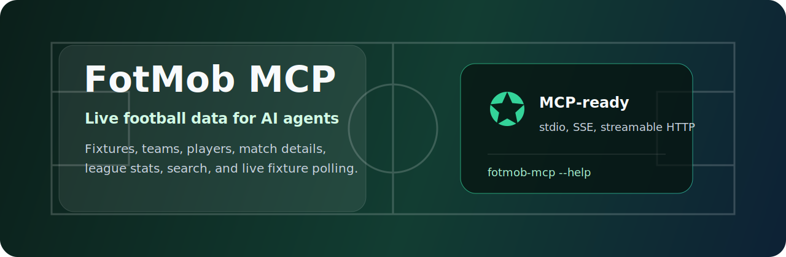

# FotMob MCP

**Live football data for AI agents, powered by verified FotMob JSON routes.**

[Quick Start](#quick-start) | [Integrations](#integrations) | [Tools](#tools) | [Routes](#supported-routes)


FotMob MCP is a standalone [Model Context Protocol](https://modelcontextprotocol.io/) server for football research, fixture lookup, team and player pages, match details, live fixture polling, and league statistics.

It gives Codex, Hermes Agent, and other MCP-compatible clients a small, predictable interface over useful FotMob data without making agents scrape pages by hand.

## Why Use It

- **Live football context**: daily matches, league pages, teams, players, transfers, TV listings, and match details.
- **Agent-friendly tools**: search, route discovery, direct route fetches, live fixtures, and top-stat helpers.
- **Production-oriented setup**: install once, expose `fotmob-mcp` on `PATH`, and register it with any MCP client.
- **Multiple transports**: stdio by default, plus SSE and streamable HTTP for hosted or agent-managed runtimes.
- **Local caching**: repeated FotMob requests are cached to reduce unnecessary network calls.

## Quick Start

From the repository root:

```bash
python3 -m venv .venv
source .venv/bin/activate
python -m pip install --upgrade pip
python -m pip install -r requirements.txt
```

`requirements.txt` installs the runtime dependencies and the local `fotmob-mcp` package in editable mode. Installing the package matters because MCP clients can start the server from any working directory as long as `fotmob-mcp` is on the agent process `PATH`.

Verify the install:

```bash
command -v fotmob-mcp
fotmob-mcp --help
```

Run the server over stdio:

```bash
fotmob-mcp
```

## Integrations

### Codex

```bash
codex mcp add fotmob -- fotmob-mcp
```

For development from a source checkout, install it editable first, then use the same registration command:

```bash
python -m pip install -e .
codex mcp add fotmob -- fotmob-mcp
```

### Hermes Agent

Install the package in the runtime environment used by Hermes, then register the package entry point:

```json
{
  "mcpServers": {
    "fotmob": {
      "command": "fotmob-mcp",
      "args": []
    }
  }
}
```

Before starting Hermes, verify that the same runtime environment can resolve the command:

```bash
command -v fotmob-mcp
```

### Streamable HTTP

If your agent expects an HTTP MCP endpoint instead of stdio, start the server with streamable HTTP:

```bash
fotmob-mcp --transport streamable-http --host 127.0.0.1 --port 8000
```

Then register:

```text
http://127.0.0.1:8000/mcp
```

Transport options can also be set with environment variables:

- `FOTMOB_MCP_TRANSPORT`: `stdio`, `sse`, or `streamable-http`
- `FOTMOB_MCP_HOST`: HTTP bind host
- `FOTMOB_MCP_PORT`: HTTP bind port
- `FOTMOB_MCP_SSE_PATH`: SSE endpoint path
- `FOTMOB_MCP_STREAMABLE_HTTP_PATH`: streamable HTTP endpoint path

## What You Can Ask

Examples of tasks this MCP is built for:

- "Find today's Premier League fixtures."
- "Search FotMob for World Cup and fetch the league page."
- "Show the current top scorers for World Cup 2026."
- "Get match details, scorers, and lineups for a match id."
- "Fetch a team's squad, history, fixtures, and stats."
- "List verified FotMob routes that mention transfers."

## Tools

| Tool | Purpose |
| --- | --- |
| `list_fotmob_routes` | List the verified route catalog, optionally filtered by keyword. |
| `fetch_fotmob_route` | Fetch a verified FotMob route by key and JSON parameters. |
| `search_fotmob` | Search FotMob suggestions for teams, players, leagues, and matches. |
| `get_live_fixtures` | Fetch live fixtures from a league payload's live poll link. |
| `get_league_top_stats` | Fetch league player or team stats and resolve internal season ids automatically. |

## Resources

- `fotmob://reference`
- `fotmob://routes`
- `fotmob://prompt`

## Configuration

Optional environment variables:

- `FOTMOB_BASE_URL`: override the default FotMob base URL
- `FOTMOB_CACHE_DIR`: change the local cache directory
- `FOTMOB_CACHE_TTL_SECONDS`: change the cache lifetime

## Supported Routes

The server currently exposes these verified FotMob routes:

| Key | Endpoint |
| --- | --- |
| `search_suggest` | `/api/data/search/suggest` |
| `all_leagues` | `/api/data/allLeagues` |
| `matches` | `/api/data/matches` |
| `leagues` | `/api/data/leagues` |
| `leagues_shotmap` | `/api/data/leagues?shotmap=true` |
| `league_season_deep_stats` | `/api/data/leagueseasondeepstats` |
| `teams` | `/api/data/teams` |
| `player_data` | `/api/data/playerData` |
| `player_matches` | `/api/data/playerMatches` |
| `match_details` | `/api/data/matchDetails` |
| `match_heatmaps` | `/api/data/heatmap/match/{matchId}/heatmaps` |
| `transfers` | `/api/data/transfers` |
| `tvlistings` | `/api/data/tvlistings` |
| `audio_matches` | `/api/data/audio-matches` |
| `dataproviders` | `/api/data/dataproviders` |

Use `list_fotmob_routes` to inspect the exact parameters and notes for each route.

## Development Check

```bash
python -m unittest
```

For a full installation smoke test, clone the repository into a clean directory, run the Quick Start commands, and verify that `fotmob-mcp --help` works outside the repository directory.
